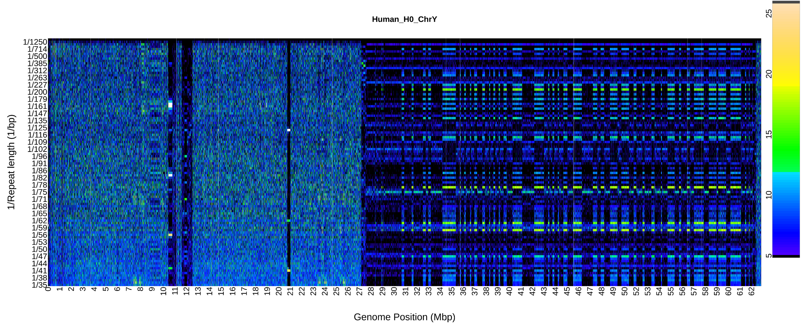

<!-- PROJECT SHIELDS -->
<!--
*** I'm using markdown "reference style" links for readability.
*** Reference links are enclosed in brackets [ ] instead of parentheses ( ).
*** See the bottom of this document for the declaration of the reference variables
*** for contributors-url, forks-url, etc. This is an optional, concise syntax:
*** https://www.markdownguide.org/basic-syntax/#reference-style-links
-->

<!-- PROJECT LOGO -->
<br />
<div align="center">
  <a href="XX">
    
  </a>
<h3 align="center">RepeatOBserver</h3>
  <p align="center">
    An R package to visualize chromosome scale repeat patterns and predict centromere locations.
    <br />
    <a href="https://github.com/celphin/RepeatOBserverV1/issues">Report Bug</a>
  </p>
</div>


<!-- TABLE OF CONTENTS -->
<details>
  <summary>Table of Contents</summary>
  <ol>
    <li>
      <a href="#getting-started">Getting Started</a>
      <ul>
        <li><a href="#software-needed">Software Needed</a></li>
        <li><a href="#r-package-installation">R Package Installation</a></li>
        <li><a href="#basic-run">Basic run</a></li>
      </ul>
    </li>
    <li><a href="#current-issues">Current Issues</a></li>
    <li><a href="#citation">Citation</a></li>
    <li><a href="#contact-and-questions">Contact and Questions</a></li>
    <li><a href="#usage-examples">Usage Examples</a></li>
    <li><a href="#troubleshooting">Troubleshooting</a></li>
  </ol>
</details>


<!-- GETTING STARTED-->
## Getting Started

RepeatOBserver is an R package that can be run on any chromosome scale reference genome assembly (e.g. fasta file). 
RepeatOBserver returns many plots describing the tandem repeats and clusters of transposons found across each chromosome. 
Based on the repeat patterns, RepeatOBserver also returns a predicted centromere location for each chromosome based on the repeat diversity across that chromosome. 

You can learn more about the interpretations of the plots in our manuscript here: 

### Software needed
The following software are need to run the automatic RepeatOBserver script: 

- seqkit/2.3.1 : https://bioinf.shenwei.me/seqkit/
- emboss/6.6.0 : https://emboss.sourceforge.net/download/
- r/4.1.2 : https://cran.r-project.org/bin/windows/base/old/

Newer versions of these software may work but the program has not yet been tested throughly in them. 
If you are unable to install any of the programs above you can run the RepeatOBserver code in R but the automated bash script will not work for you (see <a href="#troubleshooting">Troubleshooting</a> at the end of this page for details on how to run the code without this script).

Example software installation (using Compute Canada modules):
  ```sh
  module load seqkit/2.3.1
  module load StdEnv/2020 
  module load emboss/6.6.0
  module load r/4.1.2
  ```

### R Package Installation

To install the R package "RepeatOBserverV1", you will first need to install the package devtools in your version of R.

   ```sh
    install.packages("devtools")

    library(devtools)

    install_github("celphin/RepeatOBserverV1") #to install the package
	 # Select 1:All to install all the required packages

    library(RepeatOBserverV1) # to load the package

   ```

<p align="right">(<a href="#getting-started">back to top</a>)</p>

### Basic run 
Download a copy of the Setup_Run_Repeats.sh script from this github repo into the directory that you want to run the code in. 
   ```sh
wget https://github.com/celphin/RepeatOBserverV1/blob/main/Setup_Run_Repeats.sh 
   ```
   
Make sure the script is executable.
   ```sh
   chmod +x Setup_Run_Repeats.sh
   ```
Move your chromosome scale fasta file into a directory that you want to run RepeatOBserverV1 in. Make sure to unzip/gunzip the file.
In this directory, with your desired reference genome, you can run the default RepeatOBserverV1 commands automatically with the following command:

   ```sh
   sh Setup_Run_Repeats.sh -i SpeciesName -f Reference_Genome.fasta -h H0 -c c -mem m 
   ```
Note that if you need to rerun the script above you will need to remove all the chromosomes in:
./input_chromosomes/chromosome_files/

Necessary parameters:
|Parameter | Usage | Example Input| 
|----------| ------| -------------|
| -i | Species Name | Fagopyrum (cannot contain an _ or space)|
| -f | Reference genome fasta file| Fagopyrum_Main.fasta|
| -h| Haplotype (string) | H0 (cannot contain an _ or space)| 
| -c | cpus available (any integer value) | 20  |
| -m | memory available (MB) | 128000|

If you require an allocation to get enough memory or cpu on your server, here is a slurm template to follow:
   ```sh
cat << EOF > Arabidopsis_repeats.sh
#!/bin/bash
#SBATCH --account=<your-account>
#SBATCH --time=1:00:00
#SBATCH --ntasks=1
#SBATCH --cpus-per-task=15
#SBATCH --mem=128000M

module load StdEnv/2020
module load emboss/6.6.0
module load r/4.1.2

srun Setup_Run_Repeats.sh -i SpeciesName -f Reference_Genome.fasta -h H0 -c c -mem m

EOF

sbatch Arabidopsis_repeats.sh
   ```

<p align="right">(<a href="#getting-started">back to top</a>)</p>

<!-- CURRENT ISSUES -->
## Current Issues

See the [open issues](https://github.com/celphin/RepeatOBserverV1/issues) for a full list of proposed features (and known issues).

<!-- CITATION -->
## Citation

Pre-print: 

Citation:

<!-- CONTACT AND QUESTIONS-->
## Contact and Questions

If you have questions, suggestions or comments please contact:

Cassandra Elphinstone - cassandra (dot) elphinstone (at) gmail (dot) com \
Or post here: https://github.com/celphin/RepeatOBserverV1/discussions/1

[![Contributors][contributors-shield]][contributors-url]
[![Forks][forks-shield]][forks-url]
[![Stargazers][stars-shield]][stars-url]
[![Issues][issues-shield]][issues-url]

<p align="right">(<a href="#getting-started">back to top</a>)</p>

<!-- USAGE EXAMPLES -->
## Usage examples
After the initial Fourier transform has been run, there are many functions to explore and visualize the repeat patterns (described below). 
The default versions of these functions should automatically run in the script above. More specific plots can be made following the instructions below. 

### To get the centromere prediction plots

![Centromere Predictions][product-centromere]

Use the run_summary_hist and run_diversity_plots functions: 
   ```
# in R

library(RepeatOBserverV1)
inpath="~/scratch/repeats/input_chromosomes/Arab_COLCEN/chromosome_files/"
fname= "COLCEN_H0"
outpath="~/scratch/repeats/output_chromosomes"

x_cpu=1
pflag=FALSE
writeflag=FALSE
plotflag=FALSE

nam_list0 <- list.files(inpath)
nam_list1 <- tools::file_path_sans_ext(nam_list0)
nam_list1
nam_list2 <- stringr::str_split(nam_list1, "_", simplify =TRUE)
nam_list3 <- stringr::str_split(nam_list2[,3], "part", simplify =TRUE)
chr_list <- nam_list3[,1]
chr_list

# run chromosomes on different cpu
uni_chr_list <- unique(chr_list)
uni_chr_list 

for (chromosome in uni_chr_list){
  run_summary_hist(chromosome=chromosome, fname=fname, inpath=inpath, outpath=outpath)
  run_diversity_plots(chromosome=chromosome, fname=fname, inpath=inpath, outpath=outpath)
}
   ```
<p align="right">(<a href="#getting-started">back to top</a>)</p>

Move summary information and plots for all the chromosomes into one folder. 
These commands should be run on a bash terminal.
If these files cannot be found
   ```
#!/bin/bash

# set the SPP_Hap variable
SPP_Hap= <Yourspp_haplotype>

# change to the output directory path for your data - note that is may need to be changed in all that follows

cd ~/scratch/repeats/output_chromosomes/${SPP_Hap}/
mkdir Summary_output; cd Summary_output

cd ~/scratch/repeats/output_chromosomes/${SPP_Hap}/Summary_output

#-----------
# copy over the Fourier heatmaps for various ranges of repeat lengths for each 100Mbp part

mkdir spectra_parts_35-2000
cp -v -u  ~/scratch/repeats/output_chromosomes/${SPP_Hap}/Chr*/largeimages.png/All_spec1_*_Chr*_bp35_2000seq2501_*TRUE.png ./spectra_parts_35-2000

mkdir spectra_parts_15-35
cp -v -u ~/scratch/repeats/output_chromosomes/${SPP_Hap}/Chr*/largeimages.png/All_spec1_*_Chr*_bp15_35seq2501_*TRUE.png ./spectra_parts_15-35

mkdir spectra_parts_2-8
cp -v -u ~/scratch/repeats/output_chromosomes/${SPP_Hap}/Chr*/largeimages.png/All_spec1_*_Chr*_bp2_8seq2501_*TRUE.png ./spectra_parts_2-8

#------------------------------
# copy over the merged Fourier heatmaps, histogram plots and DNAwalks for the whole chromosomes

mkdir spectra_total_merged
cp -v -u ~/scratch/repeats/output_chromosomes/${SPP_Hap}/Chr*/*All_spec_bp35_2000*.png ./spectra_total_merged

mkdir histograms
cp -v -u  ~/scratch/repeats/output_chromosomes/${SPP_Hap}/Chr*/histograms/*POWER_SUM*s_0.5std_1*.pdf ./histograms/

mkdir DNAwalks
cp -v -u ~/scratch/repeats/output_chromosomes/${SPP_Hap}/Chr*/*DNAwalk*.png ./DNAwalks

#----------
# copy Shannon diversity plots

mkdir Shannon_div
cp -v -u ~/scratch/repeats/output_chromosomes/${SPP_Hap}/Chr*/${SPP_Hap}_Chr*_Shannon_plot_norm.png ./Shannon_div

mkdir Shannon_div_100
cp -v -u ~/scratch/repeats/output_chromosomes/${SPP_Hap}/Chr*/*roll_mean_Shannon_100.png ./Shannon_div_100

mkdir Shannon_div_1000
cp -v -u ~/scratch/repeats/output_chromosomes/${SPP_Hap}/Chr*/*roll_mean_Shannon_1000.png ./Shannon_div_1000

mkdir Shannon_div_250
cp -v -u ~/scratch/repeats/output_chromosomes/${SPP_Hap}/Chr*/*roll_mean_Shannon_250.png ./Shannon_div_250

mkdir Shannon_div_500
cp -v -u ~/scratch/repeats/output_chromosomes/${SPP_Hap}/Chr*/*roll_mean_Shannon_500.png ./Shannon_div_500

mkdir Shannon_div_window
cp -v -u ~/scratch/repeats/output_chromosomes/${SPP_Hap}/Chr*/*Shannon_div_window*.png ./Shannon_div_window

#-------------
# summarize the centromere results

rm Centromere_summary.txt
cat ~/scratch/repeats/output_chromosomes/${SPP_Hap}/Chr*/histograms/Centromere_*.txt > Centromere_summary.txt

rm Centromere_summary_Shannon.txt
cat ~/scratch/repeats/output_chromosomes/${SPP_Hap}/Chr*/*Centromere_MIN_Shannon.txt > Centromere_summary_Shannon.txt

grep "cent25 " Centromere_summary_Shannon.txt > Centromere_summary_Shannon_25.txt
grep "cent100 " Centromere_summary_Shannon.txt > Centromere_summary_Shannon_100.txt
grep "cent250 " Centromere_summary_Shannon.txt > Centromere_summary_Shannon_250.txt
grep "cent500 " Centromere_summary_Shannon.txt > Centromere_summary_Shannon_500.txt
grep "cent1000 " Centromere_summary_Shannon.txt > Centromere_summary_Shannon_1000.txt
grep "centwind " Centromere_summary_Shannon_35_no_telo.txt > Centromere_summary_Shannon_wind_35_no_telo.txt

   ```
<p align="right">(<a href="#getting-started">back to top</a>)</p>

### Plotting the Fourier heatmaps and DNAwalks for only a short segment of the chromosome.

![Plotting chromosome subset][product-chromosome-subset]

![Plotting a specific DNAwalk][product-DNAwalk]

Use the run_summary_plots_range function: 
   ```
# DNA walks for HA412 and HA89
# HA 412 Chr 5 37 130 000 - 37 150 000
# HA 89 Chr 5 35 520 000 - 35 550 000
# HA 89 Chr 5 38 255 000 - 38 275 000

inpath="~/scratch/repeats/input_chromosomes/Ha412/chromosome_files/"
fname= "Ha412_H0"
chromosome="Chr05"

# spectra
startbp=35005001
endbp=39000000

#----------------------

inpath="~/scratch/repeats/input_chromosomes/Sunflower/chromosome_files/"
fname= "Sunflower_H0"
chromosome="ChrHa8905"

# spectra
startbp=35005001
endbp=39000000

#----------------------
library(RepeatOBserver)

outpath="~/scratch/repeats/output_chromosomes"
x_cpu=1
pflag=FALSE
writeflag=FALSE
plotflag=FALSE

nam_list0 <- list.files(inpath)
nam_list1 <- tools::file_path_sans_ext(nam_list0)
nam_list1
nam_list2 <- stringr::str_split(nam_list1, "_", simplify =TRUE)
nam_list3 <- stringr::str_split(nam_list2[,3], "part", simplify =TRUE)
chr_list <- nam_list3[,1]
chr_list

# to plot the DNAwalks and Fourier transform heatmaps in the startbp to endbp range above
run_summary_plots_range(fname=fname, chromosome=chromosome, inpath=inpath, outpath=outpath, startbp=startbp, endbp=endbp)

   ```
<p align="right">(<a href="#getting-started">back to top</a>)</p>

### Plotting a new specific range of repeat lengths in the heatmaps of the Fourier Spectra:

![Plotting a specific repeat_lengths][product-repeat_lengths]

Use the largeimagesub_NEW function: 
   ```
   # Example Fruit Fly

inpath="~/scratch/repeats/input_chromosomes/Fly/chromosome_files/"
fname= "Fly_H0"
chromosome="ChrDlow77"
part="part01"
nam="Fly_H0_ChrDlow77part01"
#----------------------
library(RepeatOBserver)

outpath="~/scratch/repeats/output_chromosomes"
x_cpu=1
pflag=FALSE
writeflag=FALSE
plotflag=FALSE

nam_list0 <- list.files(inpath)
nam_list1 <- tools::file_path_sans_ext(nam_list0)
nam_list1
nam_list2 <- stringr::str_split(nam_list1, "_", simplify =TRUE)
nam_list3 <- stringr::str_split(nam_list2[,3], "part", simplify =TRUE)
chr_list <- nam_list3[,1]
chr_list

# writes out file for DNA walk and All_spec (the Fourier transform)
write_All_spec_DNAwalk(nam=nam, fname=fname, chromosome=chromosome, inpath=inpath, outpath=outpath)

# read in the All_spec part of interest

All_spec0<-base::as.matrix(utils::read.table(paste0(outpath,"/", fname,"/",chromosome,"/",fname, "_", chromosome,part,"_All_spec.txt"), check.names = FALSE))

# remove blank/zero columns in All_spec
colnames(All_spec0)[ncol(All_spec0)]

# https://stackoverflow.com/questions/21530168/remove-columns-with-zero-values-from-a-dataframe
All_spec0[,which(colSums(All_spec0, na.rm = FALSE, dims = 1) < 1e-5)] <- NA
All_spec <- All_spec0[,which(!is.na(colSums(All_spec0 != 0)) & colSums(All_spec0 != 0) > 0)]

# https://r-graph-gallery.com/heatmap
#stats::heatmap(All_spec[,c(1:100)], Rowv=FALSE, Colv=FALSE)
pngflag=TRUE
ofi <- paste0(outpath,"/", fname,"/", chromosome,"/", fname, "_", chromosome,part,"_All_spec_")

# set repeat lengths of interest : 17-30 bp
r1=base::c(17,30)

base::cat("\nofi:",ofi,"\n")
chromosome <- paste0(chromosome, part)
if(!base::is.null(r1))largeimagesub_NEW(All_spec,fname=fname, chromosome=chromosome,ofi,rangebp=r1,pngflag = pngflag, repround=1, part=1)

   ```
<p align="right">(<a href="#getting-started">back to top</a>)</p>

### Running a Fourier transform on larger windows to study longer repeats (e.g. 10 kbp scales).

Use the run_long_repeats_NEW function: 
   ```
   library(RepeatOBserver)
inpath="~/scratch/repeats/input_chromosomes/Einkorn/chromosome_files/"
fname= "Einkorn_H0"

outpath="~/scratch/repeats/output_chromosomes"
x_cpu=1
pflag=FALSE
writeflag=FALSE
plotflag=FALSE

nam_list0 <- list.files(inpath)
nam_list1 <- tools::file_path_sans_ext(nam_list0)
nam_list1
nam_list2 <- stringr::str_split(nam_list1, "_", simplify =TRUE)
nam_list3 <- stringr::str_split(nam_list2[,3], "part", simplify =TRUE)
chr_list <- nam_list3[,1]
chr_list

# run chromosomes on different cpu
uni_chr_list <- unique(chr_list)
uni_chr_list 

for (nam in chr_list){
print(nam)
run_long_repeats_NEW(nam=nam, fname=fname, inpath=inpath, outpath=outpath)
}

# or for a specific chromosome
chromosome="Chraeg1A"
run_long_repeats_NEW(nam=nam, fname=fname, inpath=inpath,outpath=outpath)

   ```

<p align="right">(<a href="#getting-started">back to top</a>)</p>


<!-- Troubleshooting -->
### Troubleshooting
If the script above does not run properly on your machine, you can restart RepeatOBserverV1 at any point using the code described here. 
If an output folder has already been made for a given chromosome, this folder will need to be deleted before the program can be rerun on this chromosome again.

To setup your chromosomes with the proper formatting in the command line for the instructions below. 

Change to the directory you want to run the program in:
   ```
   cd ~/scratch/repeats/
   
   # in this directory you should ahev a input and output directory
   mkdir input_chromosomes
   mkdir output_chromosomes
   cd input_chromosomes; mkdir <Your-spp-name>
   cd <Your-spp-name>

   ```

Download or copy over your fasta file here and unzip it.
   ```
   # download or copy over your fasta file here
   wget https://ftp.ncbi.nlm.nih.gov/genomes/all/GCA/...
   
   # Unzip the file if needed
   gunzip genomic.fna.gz
   ```

Fold the fasta file so that it reads in R easily and split it into chromosome fasta files
   ```
   # fold to 60bp per line to make easier to read into R
   module load seqkit/2.3.1
   seqkit seq -w 60 genomic.fna > genomic_2.fasta
   
   # make a new directory for the chromosome files
   mkdir chromosome_files/
   cd ./chromosome_files/
   
   # split the genome into a specifc file for each chromosome
   awk '/^>/ { file=substr($1,2) ".fasta" } { print > file }'  ../genomic_2.fasta

   ```
Remove the small files <5Mbp (e.g. contigs). You can run the program on smaller sequences if desired.
   ```
   find -type f -size -5000000c -delete
   ```

Chromosomes need to be named specifically for this program to work. 
Rename the chromosomes to speciesname_haplotype_chromosome. 
Note that these names cannot contain '_' or spaces and must end in '.fasta'.
   ```
   # check names with list
   ls
   # adjust the input to rename accordingly to your filenames
   rename OW20402 SPP_H0_Chr *
   rename .1.fasta .fasta *
   ```

Split all the chromosomes into <100Mbp parts. 
Chromosomes less than 100Mbp will have only one part. 
This is important for helping the program run on very large chromosomes in R.
   ```
   # loop to split long chromosomes into parts that are each 100Mbp long
   ls > ../list_chromosomes.txt
   sed 's/.fasta//g' ../list_chromosomes.txt > ../list_chrnum.txt
   while IFS= read -r Chr; 
   do
   split -l 1666666 ${Chr}.fasta ${Chr}part --numeric-suffixes=1
   rm ${Chr}.fasta
   done < ../list_chrnum.txt
   
   # check character count
   wc -c *
   
   # go one directory up and add .fasta to all the new split files
   cd ..
   find ./chromosome_files/ -type f -exec mv {} {}".fasta" \;

   ```
<p align="right">(<a href="#getting-started">back to top</a>)</p>

To run the R program on a specific chromosome

In R with the RepeatOBserverV1 package installed run the following after adjusting 
the fname, chromosome, nam(s), inpath and outpath to match your files.

   ```
library(RepeatOBserverV1)
inpath="~/scratch/repeats/input_chromosomes/Arab_COLCEN/chromosome_files/"
fname= "COLCEN_H0"
outpath="~/scratch/repeats/output_chromosomes"

x_cpu=1
pflag=FALSE
writeflag=FALSE
plotflag=FALSE

nam_list0 <- list.files(inpath)
nam_list1 <- tools::file_path_sans_ext(nam_list0)
nam_list1
nam_list2 <- stringr::str_split(nam_list1, "_", simplify =TRUE)
nam_list3 <- stringr::str_split(nam_list2[,3], "part", simplify =TRUE)
chr_list <- nam_list3[,1]
chr_list

# run chromosomes on different cpu
uni_chr_list <- unique(chr_list)
uni_chr_list 

nam="Chr4part01"
run_plot_chromosome_parallel(nam=nam, fname=fname, inpath=inpath, outpath=outpath, pflag=pflag, plotflag=plotflag,  writeflag=writeflag, x_cpu=x_cpu)
write_All_spec_DNAwalk(nam=nam, fname=fname, chromosome=chromosome, inpath=inpath, outpath=outpath)

nam="Chr4part02"
run_plot_chromosome_parallel(nam=nam, fname=fname, inpath=inpath, outpath=outpath, pflag=pflag, plotflag=plotflag,  writeflag=writeflag, x_cpu=x_cpu)
write_All_spec_DNAwalk(nam=nam, fname=fname, chromosome=chromosome, inpath=inpath, outpath=outpath)

# once all parts have run you can merge them
chromosome="Chr4"
merge_spectra(fname=fname, chromosome=chromosome, inpath=inpath, outpath=outpath)
join_chromosome_parts(fname=fname, chromosome=chromosome, inpath=inpath, outpath=outpath)

# make the main plots of the chromosome
  run_summary_hist(chromosome=chromosome, fname=fname, inpath=inpath, outpath=outpath)
  run_diversity_plots(chromosome=chromosome, fname=fname, inpath=inpath, outpath=outpath)
  run_summary_plots(chromosome=chromosome, fname=fname, inpath=inpath, outpath=outpath)
   ```
<p align="right">(<a href="#getting-started">back to top</a>)</p>

To run as a for loop through all chromosomes. 
Note that chromosomes that have an output directory already but failed will not rerun until the directory is renamed or deleted.

   ```
   # run the Fourier transform and DNAwalk conversion
for (nam in chr_list){
print(nam)
run_plot_chromosome_parallel(nam=nam, fname=fname, inpath=inpath, outpath=outpath, pflag=pflag, plotflag=plotflag,  writeflag=writeflag, x_cpu=x_cpu)
}

# write out the DNAwalks and the Fourier spectra (All_spec)
for (nam in chr_list){
print(nam)
  write_All_spec_DNAwalk(nam=nam, fname=fname, chromosome=chromosome, inpath=inpath, outpath=outpath)
}

# join the chromosome parts back together
for (chromosome in uni_chr_list){
  merge_spectra(fname=fname, chromosome=chromosome, inpath=inpath, outpath=outpath)
  join_chromosome_parts(fname=fname, chromosome=chromosome, inpath=inpath, outpath=outpath)
}

# make histogram plots, diversity plots, Fourier heatmaps and DNAwalks of the chromosomes
for (chromosome in uni_chr_list){
  run_summary_hist(chromosome=chromosome, fname=fname, inpath=inpath, outpath=outpath)
  run_diversity_plots(chromosome=chromosome, fname=fname, inpath=inpath, outpath=outpath)
  run_summary_plots(chromosome=chromosome, fname=fname, inpath=inpath, outpath=outpath)
}
   ```
<p align="right">(<a href="#getting-started">back to top</a>)</p>

To run with many cpu and on multiple chromosomes:
   ```
# in R
library(RepeatOBserverV1)
inpath="~/scratch/repeats/input_chromosomes/Arab_COLCEN/chromosome_files/"
fname= "COLCEN_H0"
outpath="~/scratch/repeats/output_chromosomes"

x_cpu=15
pflag=FALSE
writeflag=FALSE
plotflag=FALSE

nam_list0 <- list.files(inpath)
nam_list1 <- tools::file_path_sans_ext(nam_list0)
nam_list1
nam_list2 <- stringr::str_split(nam_list1, "_", simplify =TRUE)
nam_list3 <- stringr::str_split(nam_list2[,3], "part", simplify =TRUE)
chr_list <- nam_list3[,1]
chr_list

#--------------------
# run intial spectra if directories do not exist
# if directory failed partway delete it and rerun 

for (nam in nam_list1){
 run_plot_chromosome_parallel(nam=nam, fname=fname, inpath=inpath, outpath=outpath, pflag=pflag, plotflag=plotflag,  writeflag=writeflag, x_cpu=x_cpu)
}

#-----------------------
# writing of summary files on different cpu

nam_write_all_spec <- function(x, nam_list1=nam_list1, chr_list=chr_list, fname=fname, inpath=inpath, outpath=outpath, pflag=pflag, plotflag=plotflag,  writeflag=writeflag, x_cpu=x_cpu){
  library(RepeatOBserverV1)
  nam <<- nam_list1[x]
  print(nam)
  chromosome <- chr_list[x]
  print(chromosome)
  write_All_spec_DNAwalk(nam=nam, fname=fname, chromosome=chromosome, inpath=inpath, outpath=outpath)
}

x_cpu=2

cl <- parallel::makeCluster(x_cpu)
results1 <- parallel::parSapply(cl, base::seq_along(c(1:length(nam_list1))), nam_write_all_spec, nam_list1=nam_list1, chr_list=chr_list, fname=fname, inpath=inpath, outpath=outpath, pflag=pflag, plotflag=plotflag,  writeflag=writeflag, x_cpu=x_cpu)

#-----------------------
# makes summary files by merging parts of chromosomes
# run chromosomes on different cpu
uni_chr_list <- unique(chr_list)

chromosome_summary <-  function(x, uni_chr_list=uni_chr_list, fname=fname, inpath=inpath, outpath=outpath){
  library(RepeatOBserverV1)
  chromosome <<- uni_chr_list[x]
  print(chromosome)
  merge_spectra(fname=fname, chromosome=chromosome, inpath=inpath, outpath=outpath)
  join_chromosome_parts(fname=fname, chromosome=chromosome, inpath=inpath, outpath=outpath)
}
x_cpu=5
cl <- parallel::makeCluster(x_cpu)
results2 <- parallel::parSapply(cl, base::seq_along(uni_chr_list), chromosome_summary,uni_chr_list=uni_chr_list, fname=fname, inpath=inpath, outpath=outpath)

#---------------------------
# makes summary plots
# run chromosomes on different cpu

chromosome_plot <-  function(x, uni_chr_list=uni_chr_list, fname=fname, inpath=inpath, outpath=outpath){
  library(RepeatOBserverV1)
  chromosome <<- uni_chr_list[x]
  print(chromosome)
  run_summary_hist(chromosome=chromosome, fname=fname, inpath=inpath, outpath=outpath)
  run_diversity_plots(chromosome=chromosome, fname=fname, inpath=inpath, outpath=outpath)
  run_summary_plots(chromosome=chromosome, fname=fname, inpath=inpath, outpath=outpath)
}
x_cpu=5
cl <- parallel::makeCluster(x_cpu)
results2 <- parallel::parSapply(cl, base::seq_along(uni_chr_list), chromosome_plot,uni_chr_list=uni_chr_list, fname=fname, inpath=inpath, outpath=outpath)

   ```
<p align="right">(<a href="#getting-started">back to top</a>)</p>

<!-- MARKDOWN LINKS & IMAGES -->
<!-- https://www.markdownguide.org/basic-syntax/#reference-style-links -->
[contributors-shield]: https://img.shields.io/github/contributors/celphin/RepeatOBserverV1.svg?style=for-the-badge
[contributors-url]: https://github.com/celphin/RepeatOBserverV1/graphs/contributors
[forks-shield]: https://img.shields.io/github/forks/celphin/RepeatOBserverV1.svg?style=for-the-badge
[forks-url]: https://github.com/celphin/RepeatOBserverV1/network/members
[stars-shield]: https://img.shields.io/github/stars/celphin/RepeatOBserverV1.svg?style=for-the-badge
[stars-url]: https://github.com/celphin/RepeatOBserverV1/stargazers
[issues-shield]: https://img.shields.io/github/issues/celphin/RepeatOBserverV1.svg?style=for-the-badge
[issues-url]: https://github.com/celphin/RepeatOBserverV1/issues
[product-centromere]: images/centromere.png
[product-DNAwalk]: images/DNAwalk.png
[product-repeat_lengths]: images/repeat_lengths.png
[product-chromosome-subset]: images/chromosome-subset.png
[Next.js]: https://img.shields.io/badge/next.js-000000?style=for-the-badge&logo=nextdotjs&logoColor=white
[Next-url]: https://nextjs.org/
[React.js]: https://img.shields.io/badge/React-20232A?style=for-the-badge&logo=react&logoColor=61DAFB
[React-url]: https://reactjs.org/
[Vue.js]: https://img.shields.io/badge/Vue.js-35495E?style=for-the-badge&logo=vuedotjs&logoColor=4FC08D
[Vue-url]: https://vuejs.org/
[Angular.io]: https://img.shields.io/badge/Angular-DD0031?style=for-the-badge&logo=angular&logoColor=white
[Angular-url]: https://angular.io/
[Svelte.dev]: https://img.shields.io/badge/Svelte-4A4A55?style=for-the-badge&logo=svelte&logoColor=FF3E00
[Svelte-url]: https://svelte.dev/
[Laravel.com]: https://img.shields.io/badge/Laravel-FF2D20?style=for-the-badge&logo=laravel&logoColor=white
[Laravel-url]: https://laravel.com
[Bootstrap.com]: https://img.shields.io/badge/Bootstrap-563D7C?style=for-the-badge&logo=bootstrap&logoColor=white
[Bootstrap-url]: https://getbootstrap.com
[JQuery.com]: https://img.shields.io/badge/jQuery-0769AD?style=for-the-badge&logo=jquery&logoColor=white
[JQuery-url]: https://jquery.com 
